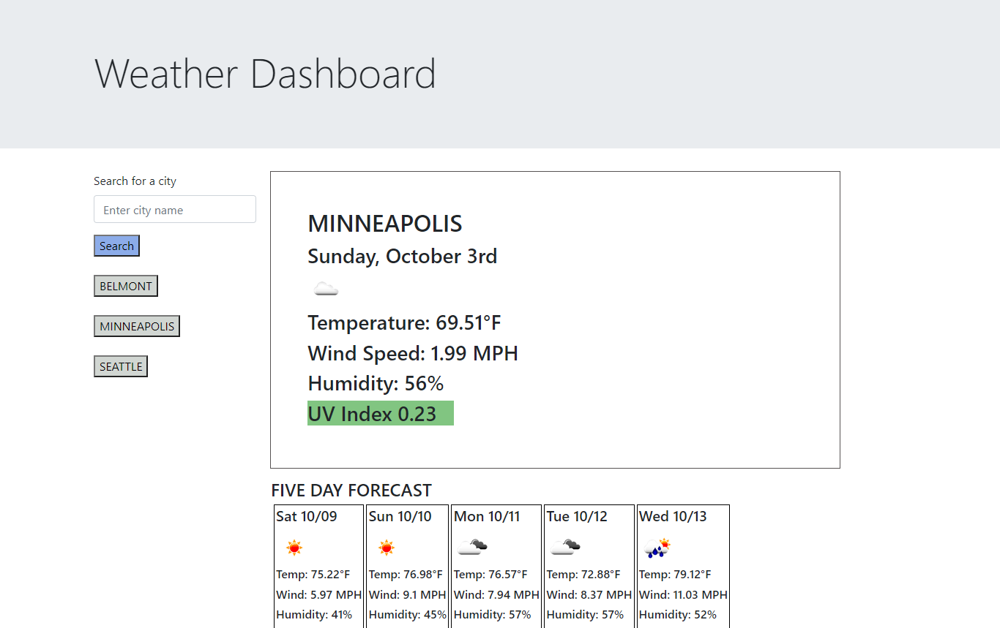

# server-side-apis-weather-dashboard
Bootcamp Homework #6

## Objective

Created a weather dashboard page. The page allows user to search a new city or click on a previously selected city button. Upon searching the current date and weather are displayed as well as a five day forecast. Displays include temperature, wind speed, humidity.  

## Screenshot

## Screenshot

## Link to deployed page

[Here is the link to my deployed code.](https://ljhofer.github.io/06-server-side-apis-weather-dashboard/)

## Tech Stack
HTML, CSS, jQuery, Bootstrap, Moment.js

## Contributor

Laura Hofer 
GitHub: ljhofer

